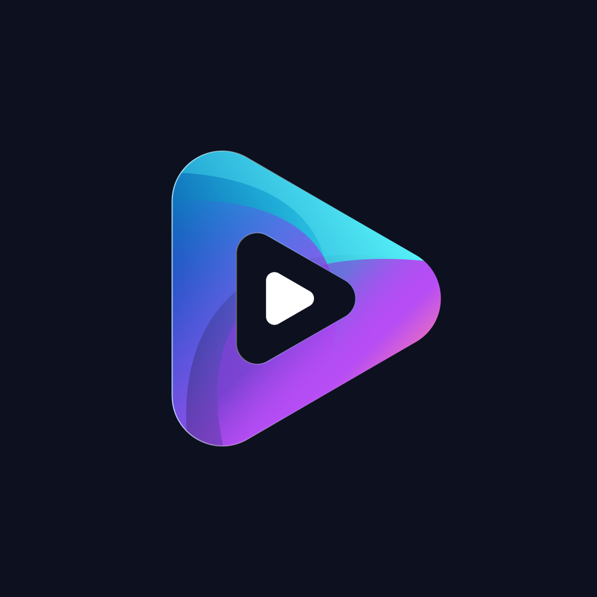

<p align="center"></p>

# Nuvio for LG webOS 3.x

**Install Nuvio on older LG UHD / 4K Smart TVs running webOS 3.0 or 3.5.** This unofficial community port provides a downloadable 1080p IPK, collection navigation and adaptations for Chromium 38 / Node 0.12.2. **Tested on LG 49UJ630V-ZA; other models remain unverified.**

[](https://github.com/tommysuzanne/nuvio-webos-3/actions/workflows/ci.yml)
[](https://github.com/tommysuzanne/nuvio-webos-3/releases/latest)
[](LICENSE)

**[Download the IPK](https://github.com/tommysuzanne/nuvio-webos-3/releases/latest)** · [Compatibility](docs/COMPATIBILITY.md) · [Installation](docs/UJ630/INSTALLATION.md) · [Français](README.fr.md) · [Report your TV model](https://github.com/tommysuzanne/nuvio-webos-3/issues/new?template=compatibility_report.yml)

Based on **Nuvio 1.1.2**, with credit to [NuvioMedia](https://github.com/NuvioMedia/NuvioTVSmart) and [iqui27's legacy webOS port](https://github.com/iqui27/NuvioTVSmart-legacy-webos). This is not an official LG or Nuvio release.

## Which LG TVs can use it?

| TV / platform | Current status |
| --- | --- |
| LG **49UJ630V-ZA**, firmware **06.10.75**, UHD | Tested installation; build43 settings/navigation smoke checks passed. See qualification limits below. |
| Other **UHD / 4K LG TVs with webOS 3.0 or 3.5** | Candidates for testing: the same Chromium 38 / Node 0.12.2 engine family. No model-wide compatibility guarantee. |
| **Full HD LG TVs with webOS 3.x** | Need a separate 720p graphics package. The current public IPK is 1080p; no FHD-qualified package is provided. |
| **webOS 1.x / 2.x** | Not supported by this release: WebKit and older Node runtimes need additional porting. |
| **webOS 4.x and newer** | Outside this release's tested target; its specific legacy performance policy does not activate on newer Chromium engines. |

These are platform-based expectations, not device test results. Memory, remote controls, firmware and native video codecs still vary. See the [compatibility matrix and LG sources](docs/COMPATIBILITY.md). A TV's firmware version is not its webOS platform version.

## How to install Nuvio on webOS 3.0 / 3.5

1. Check that your TV is an **UHD / 4K webOS 3.x model** using the [compatibility guide](docs/COMPATIBILITY.md).
2. Open [Releases](https://github.com/tommysuzanne/nuvio-webos-3/releases/latest) and download the **`.ipk`**, plus `SHA256SUMS`. The source ZIP is not the TV application.
3. Enable **Developer Mode** on the TV and pair it with your computer using LG's developer tools.
4. Follow the [installation and update instructions](docs/UJ630/INSTALLATION.md), including checksum verification, backup and service restart.
5. Sign into **your own account**, configure your own addons and manage your collections from another Nuvio client.

Developer Mode must stay enabled and be renewed before expiry. A USB drive alone does not make the installation permanent. App ID `space.nuvio.webos` replaces an existing app with that ID, so back up your settings before updating.

The public package includes **no maintainer account, personal API keys, configured addons, collection exports or personal artwork**. It reuses only the existing public client configuration from a hash-pinned upstream release. Upstream login/backend availability is outside this port's control.

## What is different in this port?

- **Collections + Continue Watching** on Home, including next and upcoming episodes; no unwanted fallback catalog rows.
- **Read-only collections on the TV**: organize them elsewhere and refresh here. Eligible home/foreground entry refreshes after five minutes; no permanent polling.
- **1080p interface**, rectangular covers, compact left navigation, fixed background and an immediate focus outline.
- **Permanent legacy performance settings**: build43 removes the old Fluent Mode switch. Optimizations activate by engine detection, not by the TV model name.
- **Virtualized navigation**, bounded caches, prioritized image loading, request cancellation and lazy-loaded screens.
- **UTF-8 display fixes**, addon synchronization corrections and 4K-first source ordering.
- **Optional personal thumbnails** prepared on your computer, including 16:9 covers without stretching. See [artwork preparation](docs/UJ630/ARTWORK.md).

Interface resolution does not fix movie resolution. Playback depends on the TV's codecs, source and network; listing 4K sources first does not make an unsupported file playable. Unsupported executable/P2P plugins remain blocked on the legacy target.

## Validation and limitations

**41 UJ630 regression groups and 102 native JavaScript tests** run alongside build and legacy compatibility checks. CI builds a placeholder package with no account secrets. The public release additionally has package syntax, provenance and private-data checks.

One LG 49UJ630V-ZA has been tested. Historical build42 frame p99 measurements were **33.611 / 19.780 / 33.428 ms**, below the subsequently accepted 35 ms threshold; the original 33 ms failures remain documented. Build43 received short checks on that TV with private artwork. **The downloadable public binary has not received a separate full TV performance or playback qualification.**

Long-term memory stability, precise HEVC seeking and physical standby/restart coverage remain incomplete. No claim of universal compatibility or zero lag is made. [Measurements, methodology and limits](docs/UJ630/VALIDATION.md) · [Build43 changes](docs/UJ630/RELEASE-43.md).

## Frequently asked questions

**Does it support every TV below webOS 3.5?** No. The intended target is UHD webOS 3.x. webOS 1.x/2.x use a different app engine, and FHD models need a different graphics package.

**Why does the current IPK filename still contain UJ630?** The project started on that model. Build43 filenames, tags and checksums are retained to preserve release identity; runtime optimizations detect the web engine. Renaming the project does not certify additional models.

**Will I get somebody else's account or addons?** No. Each installer uses their own account and settings. Never share account exports, addon configuration URLs or API keys in an issue.

**Will new collections appear without reinstalling?** Eligible remote collections refresh without rebuilding. Their covers must pass the image policy; unsupported images may use a title card or optional locally prepared thumbnail.

**Can Nuvio update itself automatically?** Official update checks are disabled on the legacy target. Upstream changes need integration and validation; install a reviewed release manually.

**The app vanished after disabling Developer Mode. Why?** Developer-installed apps depend on that mode. Keep it enabled and renew its session; this project does not root or change firmware.

## Build from source

Use Node.js 22 or newer:

```sh
git clone https://github.com/tommysuzanne/nuvio-webos-3.git
cd nuvio-webos-3
npm ci --ignore-scripts
npm run build:release
```

The release helper verifies the pinned upstream IPK and refuses private local configuration/artwork. It writes the public package and provenance manifest outside the checkout. Alternative local configuration is covered in [the build guide](docs/UJ630/INSTALLATION.md).

```sh
npm run validate:public
```

This runs local tests and a **CHECK-ONLY** placeholder package build; that placeholder cannot authenticate and is not the downloadable release. Evidence is written outside the checkout. The repository name has changed; internal `UJ630` module names and historical documentation paths retain their original names for traceability.

## Help, compatibility reports and contributions

[Report a TV model](https://github.com/tommysuzanne/nuvio-webos-3/issues/new?template=compatibility_report.yml) · [Report a bug](https://github.com/tommysuzanne/nuvio-webos-3/issues/new?template=bug_report.yml) · [Contributing](CONTRIBUTING.md) · [Repository protections](docs/MAINTENANCE.md)

Model reports help build an evidence-based compatibility list. Include model, webOS version, firmware, package label, installation result, remote navigation and a lawful playback test. A community report is not automatically a verified compatibility claim. Remove all personal data before posting.

## License and credits

**GNU GPL v3**. The original [LICENSE](LICENSE), upstream authorship and component notices are preserved. [Credits and pinned revisions](NOTICE.md). Application branding remains credited to its owners; the code license does not grant rights to posters, studio logos or downloaded artwork.
